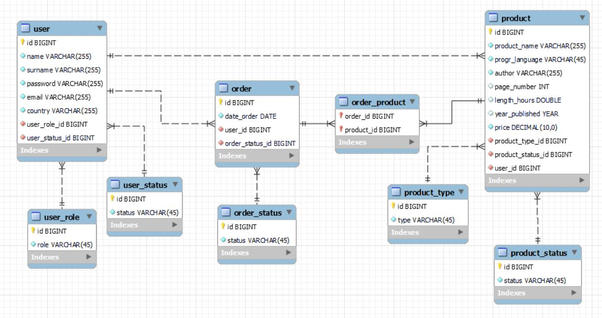

## IT-Shop

***

#### General functionality of the project.
 - Sign in and sign out;
 - Sign up;
 - Viewing the existing information (f.e. viewing all existing in the system products);
 - Removing information (f.e. inactivating the product);
 - Adding and modifying the information (f.e. creation of new product, updating the existing product's info).

#### Technologies
Spring Framework, Hibernate, MySQL, JSP, JSTL, Log4J2

#### Database diagram

